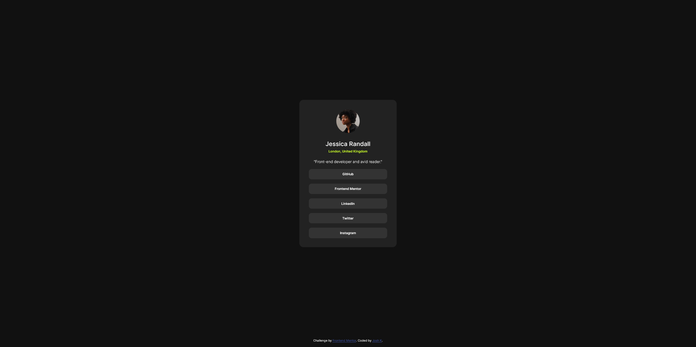

# Frontend Mentor - Social links profile solution

This is a solution to the [Social links profile challenge on Frontend Mentor](https://www.frontendmentor.io/challenges/social-links-profile-UG32l9m6dQ). Frontend Mentor challenges help you improve your coding skills by building realistic projects. 

## Table of contents

- [Overview](#overview)
  - [The challenge](#the-challenge)
  - [Screenshot](#screenshot)
  - [Links](#links)
- [My process](#my-process)
  - [Built with](#built-with)
  - [What I learned](#what-i-learned)
  - [Continued development](#continued-development)
  - [Useful resources](#useful-resources)
- [Author](#author)
- [Acknowledgments](#acknowledgments)

## Overview

### The challenge

Users should be able to:

- See hover and focus states for all interactive elements on the page

### Screenshot

### Links

- Solution URL: [https://github.com/jkaps9/social-links-profile-main](https://github.com/jkaps9/social-links-profile-main)
- Live Site URL: [https://jkaps9.github.io/social-links-profile-main/](https://jkaps9.github.io/social-links-profile-main/)

## My process

### Built with

- Flexbox

### What I learned

Practice with Flexbox and dynamic sizing

### Continued development

Need to fine tune my abilities to format in CSS

### Useful resources

Brad Traversy's YouTube series

## Author

- Frontend Mentor - [@jkaps9](https://www.frontendmentor.io/profile/jkaps9)

**Note: Delete this note and add/remove/edit lines above based on what links you'd like to share.**

## Acknowledgments

Brad Traversy's YouTube series